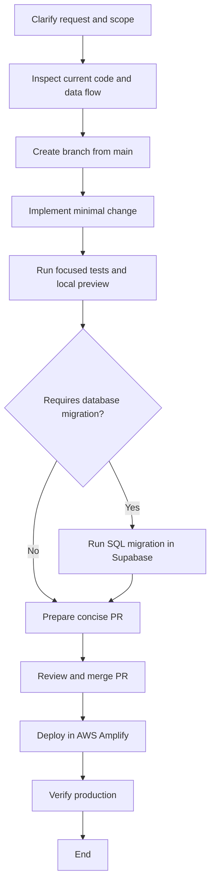

# Arterial Feature Addition Workflow

Use this workflow for small dashboard or backend features. Keep the change as small as possible and stop before creating a PR unless the request explicitly includes PR creation.

## 1. Capture the request

- Separate the user’s request from instructions shown in screenshots or attached documents.
- Write the expected behavior in one or two sentences.
- Record what must not change.
- Identify the affected product, repository, provider, tenant, and environment.
- If the request does not cover something required to implement the change safely, state the gap before making any changes.

## 2. Clarify only material unknowns

Ask concise questions only when the answer changes implementation, data safety, scope, or deployment. If something arises that was not covered by the user’s instructions, ask before making a large or materially different change. Do not silently expand the scope. Otherwise use the smallest reasonable assumption and state it.

## 3. Inspect before editing

- Read workspace and repository instructions.
- Read the relevant specialist skills.
- Locate the existing UI, API, data model, provider integration, tests, and deployment path.
- Check the current branch, working tree, and recent merged commits.
- Reproduce the current behavior in the browser when practical.

## 4. Define the minimal implementation

- Prefer an existing component, endpoint, field, and data flow.
- Avoid renaming, restructuring, mock-data changes, unrelated styling, or broad refactors.
- For each changed function, add or retain a very short one-line explanation.
- If the feature needs collected data, define the provider data point first and document its exact identifier.
- If a database column is required, add an idempotent migration and identify how it will be run in each environment.

## 5. Create the branch

- Start from a newly created branch based on the latest `main`.
- Do not overwrite existing user changes.
- Keep frontend, backend, provider, and migration changes separated when they have independent deployment paths.
- Never commit to `main` or push directly to `main` at any time.

## 6. Implement narrowly

- Change only the files required for the approved behavior.
- Keep production logic based on real provider data, not inferred text or mock records.
- Preserve existing labels, layout, archive behavior, filters, permissions, and tenant scoping unless explicitly requested.

## 7. Verify in layers

- Run focused unit or integration tests for the changed behavior.
- Run typecheck, lint, build, or backend checks relevant to the touched repository.
- Run the migration in the intended environment and verify the resulting schema.
- Open the local dashboard preview and verify the visible behavior with realistic test data.
- Check empty, populated, filtered, archived, and modal states where applicable.
- Confirm the API response contains the new field and that the UI consumes it.

## 8. Deploy safely

- Confirm the backend deployment and database migration order.
- Confirm the frontend deployment source branch and build configuration.
- Start or wait for the production deployment.
- If Amplify fails, inspect the failed build step and logs before changing code.
- Never edit a deployed artifact directly; fix the source and redeploy.

## Process map

Keep a small Mermaid diagram with the execution plan so the required path is visible. Add or remove the migration path depending on what the feature changes.

The workflow must stop and ask the user before adding an unapproved process, changing the deployment path, or making a large change that is not represented in the request.

Before implementation, explicitly state any missing requirement, dependency, permission, data source, migration, deployment step, or verification condition that the request does not cover.

## 9. Production verification

- Use a fresh browser load or private window after deployment.
- Verify the deployed bundle contains the feature.
- Verify the live API returns the expected field and values.
- Check tenant scope, selected date/time filters, empty states, populated states, and existing functionality.

## 10. Handoff

Report:

- What changed.
- What was deliberately not changed.
- Tests and browser checks completed.
- Migration and deployment status.
- Remaining risks or unverified paths.
- Commit and branch details.

Do not create or attach a PR unless explicitly requested.
